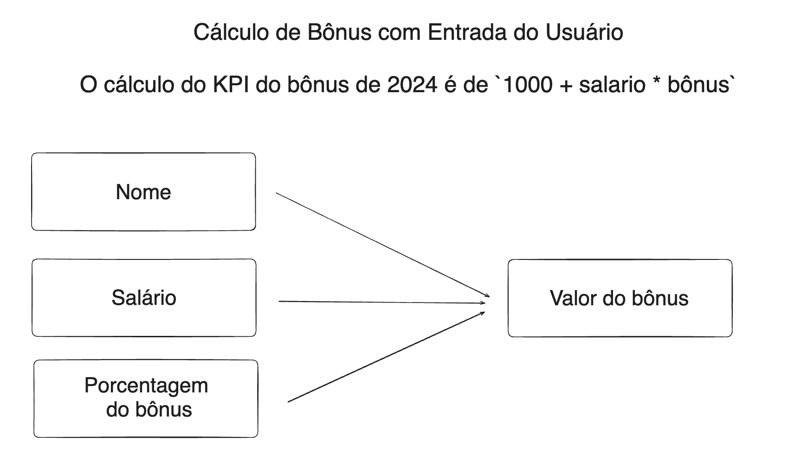

# Aula_03_pythonAula 03: DEBUG, IF, FOR, While, Listas e Dicionários em Python

Foi realizado o estudo de controle de fluxo e iniciado o assunto de listas e dicionários e realizado alguns exercícios de fixação.

## Exercício 1: Verificação de Qualidade de Dados

 Você está analisando um conjunto de dados de vendas e precisa garantir que todos os registros tenham valores positivos 
 para quantidade e preço. Escreva um programa que verifique esses campos e imprima "Dados válidos" se ambos forem positivos ou "Dados inválidos" caso contrário.

````
quantidade = input("Digite a quantidade: ")
preco = input("Digite o preço: ")

try:
    quantidade = float(quantidade)
    preco = float(preco)    
    if quantidade > 0 and preco > 0:
        print("Dados validos")
    else:
        print("Dados invalidos")
except:
    print("Digite valores numericos")
````
## Exercício 2: Classificação de Dados de Sensor

Imagine que você está trabalhando com dados de sensores IoT. 
Os dados incluem medições de temperatura. 
Você precisa classificar cada leitura como 'Baixa', 'Normal' ou 'Alta'. 
Considerando que:

* Temperatura < 18°C é 'Baixa'
* Temperatura >= 18°C e <= 26°C é 'Normal'
* Temperatura > 26°C é 'Alta'

````
temperatura = input("Digite a temperatura: ")

try:
    temperatura = float(temperatura)
    if temperatura < 18:
        print(f"A temperatura de {temperatura}°C e Baixa")
    elif 18 <= temperatura <= 26:
        print(f"A temperatura de {temperatura}°C e Normal")
    else:
        print(f"A temperatura de {temperatura}°C e Alta")   
except:
    print("Digite valores numericos")    
````

## Exercício 3: Filtragem de Logs por Severidade

Você está analisando logs de uma aplicação e precisa filtrar mensagens com severidade 'ERROR'. 
Dado um registro de log em formato de dicionário como 
log = {'timestamp': '2021-06-23 10:00:00', 'level': 'ERROR', 'message': 'Falha na conexão'}, 
escreva um programa que imprima a mensagem se a severidade for 'ERROR'.

````
log = {'timestamp': '2021-06-23 10:00:00', 'level': 'ERROR', 'message': 'Falha na conexão'}

if log['level'] == 'ERROR':
    print(log['message'])
````
## Exercício 4: Validação de Dados de Entrada

 Antes de processar os dados de usuários em um sistema de recomendação, você precisa garantir que cada usuário tenha idade entre 18 e 65 anos e tenha fornecido um email válido. Escreva um programa que valide essas condições e imprima "Dados de usuário válidos" ou o erro específico encontrado.

````
nome = input("Digite seu nome: ")
idade = input("Digite sua idade: ")
email = input("Digite seu email: ")

try:
    idade = int(idade)
    if 18 <= idade <= 65:
        if '@' in email and '.' in email:
            print("Dados validos")
        else:
            print("Email invalido")
    else:
        print("Idade invalida")
except:
    print("Digite valores numericos")
````
## Exercício 5: Detecção de Anomalias em Dados de Transações

 Você está trabalhando em um sistema de detecção de fraude e precisa identificar transações suspeitas. Uma transação é considerada suspeita se o valor for superior a R$ 10.000 ou se ocorrer fora do horário comercial (antes das 9h ou depois das 18h). Dada uma transação como transacao = {'valor': 12000, 'hora': 20}, verifique se ela é suspeita.

````
transacao = {'valor': 12000, 'hora': 20}

if transacao['valor'] > 10000 or transacao['hora'] < 9 or transacao['hora'] > 18:
    print("Transacao suspeita")
else:
    print("Transacao confirmada")
````
## Exercício 6. Contagem de Palavras em Textos

 Objetivo: Dado um texto, contar quantas vezes cada palavra única aparece nele.

````
texto = "O rato roeu a roupa do rei de roma, e o rei de roma roeu a roupa do rato."

palavra_contada = {}

texto_sem_acentos = texto.lower().replace(',', '').replace('.', '') 
for palavra in texto_sem_acentos.split():
    if palavra in palavra_contada:
        palavra_contada[palavra] += 1
    else:
        palavra_contada[palavra] = 1

print(palavra_contada)    
````
##  Exercício 7. Normalização de Dados

 Objetivo: Normalizar uma lista de números para que fiquem na escala de 0 a 1.

````
lista_numericos = [1,2,5,6,8,5,10,2,55,35]
maximo = max(lista_numericos)
minimo = min(lista_numericos)
normalizada = []
for numero in lista_numericos:
    normalizada.append(round((numero - minimo) / (maximo - minimo),3))

normalizada.sort()
print(normalizada)
````

## Exercício 8. Filtragem de Dados Faltantes

Objetivo: Dada uma lista de dicionários representando dados de usuários, filtrar aqueles que têm um campo específico faltando.

````
usuarios = [
    {"nome": "Alice", "email": "alice@example.com"},
    {"nome": "Bob", "email": ""},
    {"nome": "Carol", "email": "carol@example.com"},
    {"nome": "Julia", "email": ""}
]

for usuario in usuarios:
    for chave, valor in usuario.items():
        if not valor:
            print(f"O campo {chave} do usuario {usuario['nome']} esta faltando")  
print("Fim")
````
## Exercício 9. Extração de Subconjuntos de Dados

Objetivo: Dada uma lista de números, extrair apenas aqueles que são pares.

````
numeros = range(1, 21)
pares = []
for numero in numeros:
    if numero % 2 == 0:
        pares.append(numero)
print(pares)     
````
## Exercício 10. Agregação de Dados por Categoria

Objetivo: Dado um conjunto de registros de vendas, calcular o total de vendas por categoria.

````
vendas = [
    {"categoria": "eletrônicos", "valor": 1200},
    {"categoria": "livros", "valor": 200},
    {"categoria": "eletrônicos", "valor": 800},
    {"categoria": "livros", "valor": 50},
    {"categoria": "roupas", "valor": 300},
    {"categoria": "livros", "valor": 10}
]

soma_por_categoria = {}

for item in vendas:
    if item['categoria'] in soma_por_categoria:
        soma_por_categoria[item['categoria']] += item['valor']
    else:
        soma_por_categoria[item['categoria']] = item['valor']

print("Categoria    | Soma")
print("-" * 20)  # Linha de separação

for categoria, soma in soma_por_categoria.items():
    print(f"{categoria: <12} | R$ {soma}")
````

## Exercício 11. Leitura de Dados até Flag

Objetivo: Ler dados de entrada até que uma palavra-chave específica ("sair") seja fornecida.

````
dados = []
entrada = ""

while entrada.lower() != "sair":
    entrada = input("Digite algo ou 'sair' para encerrar: ")
    if entrada.lower() != "sair":
        dados.append(entrada)
print(dados)
````        

## Exercício 12. Validação de Entrada
Objetivo: Solicitar ao usuário um número dentro de um intervalo específico até que a entrada seja válida.

````
intervalo = (1, 10)
entrada = input("Digite um número entre 1 e 10: ")

try:
    entrada = int(entrada)
    while not (intervalo[0] <= entrada <= intervalo[1]):
        entrada = int(input("Por favor, Digite um número entre 1 e 10: "))
    print("Entrada validada")
except:
    print("Digite apenas números")
````        

## Exercício 13. Consumo de API Simulado

Objetivo: Simular o consumo de uma API paginada, onde cada "página" de dados é processada em loop até que não haja mais páginas.

````
pagina_atual = 1
pagina_final = 5

while pagina_atual <= pagina_final:
    print(f"Processando dados da pagina {pagina_atual} de {pagina_final}")
    pagina_atual += 1
print("Fim da pagina")
````

## Exercício 14. Tentativas de Conexão

Objetivo: Simular tentativas de reconexão a um serviço com um limite máximo de tentativas.

````
tentativas = 0
tentativas_maximas = 5

while tentativas < tentativas_maximas:
    tentativas += 1
    print(f"Tentativa {tentativas} de {tentativas_maximas}")
    tentativas_maximas -= 1
    if tentativas_maximas == 0:
        print("Fim das tentativas")
        break
    else:
        continue
print("Conexão finalizada")
````

## Exercício 15. Processamento de Dados com Condição de Parada
Objetivo: Processar itens de uma lista até encontrar um valor específico que indica a parada.

````
itens = [1, 2, 3, "parar", 4, 5]

i = 0
while itens[i] != "parar":
    print(itens[i])
    i += 1
print("Fim da lista")
````

## Desafio: Cálculo de Bônus com Entrada do Usuário

Na aula 01 foi feito um programa em Python que solicita ao usuário para digitar seu nome, o valor do seu salário mensal e o valor do bônus que recebeu. O programa deve, então, imprimir uma mensagem saudando o usuário pelo nome e informando o valor do salário em comparação com o bônus recebido.
Na aula 02 foi realizado teste de vários possiveis erros que podem ocorrer quando o usuario insere dados.
Na aula 03 foi feito controle para retornar sempre que o usuario inserir um dado não valido.


````
bonus_2024 = 1000

# Solicite ao usuario que digite seu nome
# Verificar se o nome foi preenchido
# Verificar se o nome não contém apenas espacos em branco	
# Verificar se o nome não contem números
# Ficar retornando para o programa caso o nome seja inválido


while True:
    nome = input("Digite seu nome: ")

    if nome == "":
        print("O nome deve ser preenchido")
    elif nome.isspace():
        print("O nome não deve conter apenas espaços em branco")
    elif any(char.isdigit() for char in nome):
        print("Seu nome deve conter apenas letras")
    else:
        break


# Solicite ao usuario que digite o valor do seu salário
# Verificar se o valor do salário foi preenchido
# Verificar se o valor do salário é um número
# Verificar se o valor do salário é maior que zero

while True:
    
    try:
        salario = input("Digite seu salario: ")
        if salario == "":
            print("O valor do salario deve ser preenchido")
        elif salario.isspace():
            print("O valor do salario deve ser preenchido")
        elif not any(char.isdigit() for char in salario):
            print("O valor do salario deve ser um numero")
        elif any(test == "," for test in salario):
            print("O valor deve usar ponto em vez de virgula")
        else:
            salario = float(salario)
            if float(salario) <= 0:
                print("O valor do salario deve ser maior que zero")
            else:
                break
    except ValueError as e:
        print(e)
        
    
# Solicite ao usuario que digite o valor do bônus recebido
# Verificar se o valor do salário foi preenchido
# Verificar se o valor do salário é um número
# Verificar se o valor do salário é maior que zero


while True:
    try:
        bonus = input("Digite seu bonus: ")
        if bonus == "":
            print("O valor do bonus deve ser preenchido")
        elif not any(char.isdigit() for char in bonus):    
            print("O valor do bonus deve ser um número")
        elif any(test == "," for test in bonus):
            print("O valor deve usar ponto em vez de virgula")
        else:
            bonus = float(bonus)
            if float(bonus) <= 0:
                print("O valor do bonus deve ser maior que zero")
            else:
                break    
    except ValueError as e:
        print(e)
        

# Calcule o valor do bônus final

final_bonus = (salario*bonus)

# Imprima o cálculo do KPI para o usuário
# Imprima a mensagem personalizada incluindo o nome do usuário, e o valor do bônus

kpi_2 = (bonus_2024 + final_bonus)
print(f"Oi {nome} seu bônus final ficou em {kpi_2:.2f} reais")
````
